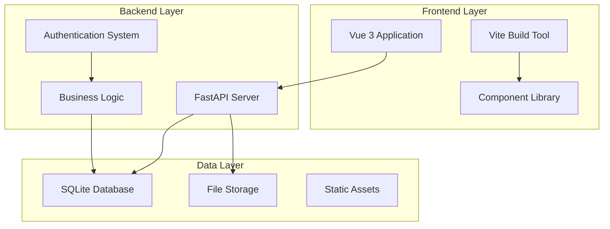
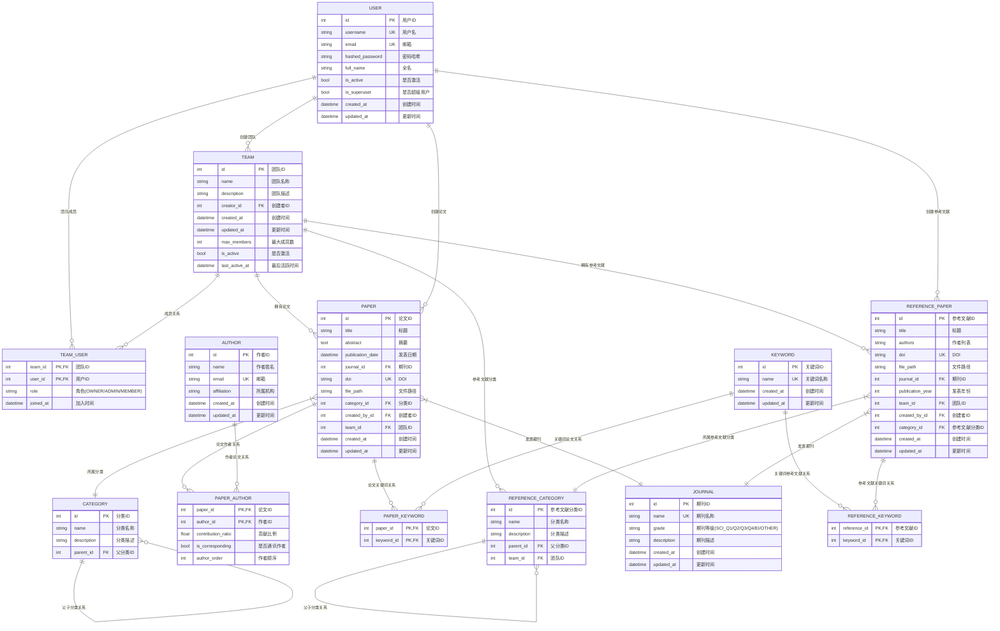

# 📚 Paper Manager - 学术论文管理系统

<div align="center">


</div>

> 🎯 一个现代化的学术论文管理平台，支持团队协作、论文管理、参考文献管理和数据分析等功能。

<div align="center">

**[🚀 快速开始](#-快速开始)** | **[💡 功能特性](#-主要功能)** | **[🛠️ API 文档](#-api-文档)**

</div>

## 🌟 项目简介

Paper Manager 是一个基于 Web 的学术论文管理系统，旨在帮助研究人员和学术团队高效地管理论文、参考文献和研究资料。系统采用前后端分离架构，提供了直观的用户界面和强大的后端 API 支持。

> [!NOTE]
> 本项目专为学术研究团队设计，提供完整的论文生命周期管理解决方案。

### 🛠️ 技术栈

| 组件           | 技术选型               | 版本要求 |
| -------------- | ---------------------- | -------- |
| 🎨 **前端框架** | Vue 3 + Vite           | Vue 3.0+ |
| ⚡ **构建工具** | Vite                   | Latest   |
| 🔧 **开发语言** | JavaScript             | ES2020+  |
| 🚀 **后端框架** | FastAPI                | Latest   |
| 🐍 **运行时**   | Python                 | 3.12+    |
| 🗄️ **数据库**   | SQLite                 | 3.0+     |
| 📦 **包管理**   | npm (前端) / uv (后端) | -        |

### 🏗️ 系统架构



## ✨ 主要功能

### 👥 用户与团队管理

- ✅ 用户注册、登录和个人信息管理
- ✅ 团队创建与成员管理
- ✅ 基于角色的权限控制（OWNER、ADMIN、MEMBER）
- 🔐 JWT 令牌认证系统
- 👤 个人资料自定义设置

### 📄 论文管理

- ✅ 论文信息录入与编辑（标题、摘要、作者、关键词等）
- ✅ 支持多作者管理和贡献率计算
- ✅ 论文分类管理（层次化分类结构）
- ✅ PDF 文件上传、预览和下载
- ✅ 论文工作量计算和统计分析
- ✅ 高级搜索和筛选功能
- ✅ Excel 导出功能
- 🔍 智能标签系统
- 📊 引用关系图谱

### 📚 参考文献管理

- ✅ 参考文献信息管理
- ✅ 按团队隔离的分类体系
- ✅ 文件上传和管理
- ✅ 批量导入和导出
- 🔄 自动格式化引用
- 🌐 在线数据库集成

### 📊 期刊与分析

- ✅ 期刊信息管理（SCI 分区、影响因子等）
- ✅ 作者合作关系网络分析
- ✅ 工作量统计和报告生成
- ✅ 可视化数据展示
- 📈 趋势分析报告
- 🏆 影响力评估

### 🔍 高级功能

- ✅ 数据导出（Excel 格式）
- ✅ 文件预览和管理
- ✅ RESTful API 接口
- 🤖 AI 辅助论文分析
- 🔔 智能通知系统
- 📱 移动端适配

### 🎯 功能路线图

- [x] 基础用户管理系统
- [x] 论文CRUD操作
- [x] 文件上传与预览
- [x] 团队协作功能
- [x] 数据导出功能
- [ ] AI 论文推荐系统
- [ ] 移动端应用
- [ ] 高级数据可视化
- [ ] 第三方集成（Google Scholar, PubMed）
- [ ] 多语言支持

## 🚀 快速开始

> [!IMPORTANT]
> 请确保你的开发环境满足以下要求才能顺利运行项目。

### 📋 环境要求

| 软件          | 版本要求 | 下载链接                                  |
| ------------- | -------- | ----------------------------------------- |
| 🟢 **Node.js** | 16.0+    | [官方下载](https://nodejs.org/)           |
| 🐍 **Python**  | 3.12+    | [官方下载](https://python.org/)           |
| 📦 **uv**      | 最新版   | [GitHub](https://github.com/astral-sh/uv) |

### 🔧 安装步骤

#### 1️⃣ 克隆项目

```bash
git clone <repository-url>
cd paper-manager
```

#### 2️⃣ 后端设置

> [!TIP]
> 推荐使用 `uv` 作为 Python 包管理器，它比 pip 更快更可靠。

```bash
cd paper-manager-backend

# 🚀 使用 uv 安装依赖（推荐，或在使用 uv 运行应用时自动安装依赖）
uv sync

# 或者使用传统的 pip 方式
pip install -r requirements.txt

# 📝 配置环境变量（可选）
cp .env.example .env
# 编辑 .env 文件中的配置项

# 🔥 启动后端服务，uv 将自动安装依赖
uv run fastapi dev
# 或者
uv run uvicorn app.main:app --reload

# 不使用 uv 的启动方式
fastapi dev
# 或者
uvicorn app.main:app --reload
```

> [!NOTE]
> 后端服务将在 `http://localhost:8000` 启动
>
> 📚 **API 文档访问地址:**
>
> - Swagger UI: <http://localhost:8000/docs>
> - ReDoc: <http://localhost:8000/redoc>

#### 3️⃣ 前端设置

```bash
cd paper-manager-frontend

# 📦 安装依赖
npm install

# 🚀 启动开发服务器
npm run dev
```

> [!NOTE]
> 前端应用将在 `http://localhost:5173` 启动

#### 4️⃣ 创建管理员账户

> [!WARNING]
> 首次运行时若无管理员账户，将自动创建。你也可以使用脚本配置管理员账户：

```bash
cd paper-manager-backend

# 🔑 创建管理员账户
uv run scripts/create_admin.py [Arguments]
# 或者
python scripts/create_admin.py [Arguments]
```

详细说明请参考：[📖 管理员工具指南](./paper-manager-backend/docs/ADMIN_TOOLS_GUIDE.md)

## 📁 项目结构

```text
paper-manager/
├── 📁 paper-manager-backend/     # 🚀 后端 API 服务
│   ├── 📁 app/                     # 🏠 应用主目录
│   │   ├── 📁 api/                   # 🛣️  API 路由
│   │   ├── 📁 core/                  # ⚙️  核心配置
│   │   ├── 📁 models/                # 🗃️  数据模型
│   │   ├── 📁 schemas/               # 📝 Pydantic 模型
│   │   ├── 📁 services/              # 🔧 业务逻辑
│   │   └── 📁 static/                # 📦 静态文件
│   ├── 📁 data/                    # 💾 数据文件
│   ├── 📁 scripts/                 # 🔨 辅助脚本
│   └── 📁 docs/                    # 📚 后端文档
├── 📁 paper-manager-frontend/    # 🎨 前端 Vue 应用
│   ├── 📁 src/                     # 💻 源代码
│   │   ├── 📁 components/            # 🧩 Vue 组件
│   │   ├── 📁 pages/                 # 📄 页面组件
│   │   ├── 📁 composables/           # 🔗 组合式函数
│   │   ├── 📁 services/              # 🌐 API 服务
│   │   ├── 📁 assets/                # 🖼️  静态资源
│   │   ├── 📁 router/                # 🧭 路由配置
│   │   ├── 📁 mocks/                 # 🎭 Mock 数据
│   │   ├── 📁 config/                # ⚙️  配置文件
│   │   └── 📁 utils/                 # 🛠️  工具函数
│   ├── 📁 public/                  # 🌍 静态资源
│   └── 📁 docs/                    # 📖 前端文档
└── 📄 README.md                  # 📋 项目说明文档
```

### 🏗️ 数据库设计

Paper Manager 使用 SQLite 数据库，采用 SQLModel (基于 Pydantic 和 SQLAlchemy) 进行 ORM 映射。数据库设计支持层次化分类、多对多关系管理和团队隔离。

#### 📊 实体关系图



#### 🗃️ 核心数据表说明

| 表名                   | 中文名称             | 主要功能                   | 关键字段                                 |
| ---------------------- | -------------------- | -------------------------- | ---------------------------------------- |
| **user**               | 用户表               | 存储用户基本信息和认证数据 | `username`, `email`, `hashed_password`   |
| **team**               | 团队表               | 管理团队信息和设置         | `name`, `creator_id`, `max_members`      |
| **team_user**          | 团队成员关联表       | 管理用户与团队的多对多关系 | `team_id`, `user_id`, `role`             |
| **paper**              | 论文表               | 存储论文核心信息           | `title`, `abstract`, `doi`, `team_id`    |
| **author**             | 作者表               | 管理作者信息               | `name`, `email`, `affiliation`           |
| **paper_author**       | 论文作者关联表       | 管理论文与作者的多对多关系 | `contribution_ratio`, `is_corresponding` |
| **category**           | 论文分类表           | 层次化的论文分类管理       | `name`, `parent_id`                      |
| **keyword**            | 关键词表             | 统一的关键词管理           | `name`                                   |
| **paper_keyword**      | 论文关键词关联表     | 论文与关键词的多对多关系   | `paper_id`, `keyword_id`                 |
| **journal**            | 期刊表               | 期刊信息和等级管理         | `name`, `grade`                          |
| **reference_paper**    | 参考文献表           | 参考文献信息管理           | `title`, `authors`, `team_id`            |
| **reference_category** | 参考文献分类表       | 团队级别的参考文献分类     | `name`, `team_id`, `parent_id`           |
| **reference_keyword**  | 参考文献关键词关联表 | 参考文献与关键词关系       | `reference_id`, `keyword_id`             |

## 📖 API 文档

> [!TIP]
> 启动后端服务后，可以通过以下链接访问完整的 API 文档。

### 📚 在线文档

| 文档类型             | 访问地址                             | 描述                          |
| -------------------- | ------------------------------------ | ----------------------------- |
| 🌟 **Swagger UI**     | <http://localhost:8000/docs>         | 交互式 API 文档，支持在线测试 |
| 📖 **ReDoc**          | <http://localhost:8000/redoc>        | 美观的 API 文档展示           |
| 🔧 **OpenAPI Schema** | <http://localhost:8000/openapi.json> | OpenAPI 3.0 规范文件          |

### 📋 相关文档

- **[📘 后端 README](./paper-manager-backend/README.md)** - 包含完整的 API 接口说明
- **[🔑 管理员工具指南](./paper-manager-backend/docs/ADMIN_TOOLS_GUIDE.md)** - 管理员操作手册

## 🎯 主要特性

### 🔐 安全性

- 🛡️ JWT 令牌认证
- 🔑 基于角色的访问控制（RBAC）
- 🏢 数据隔离和权限管理
- 🔒 密码加密存储
- 🚫 CORS 防护

### 📊 数据管理

- 🗄️ SQLite 数据库支持
- 📤 数据导入导出功能
- 📁 文件上传和管理
- 🔄 自动备份机制
- 📈 数据统计分析

### 🎨 用户体验

- 📱 响应式设计
- 🌙 现代化 UI 界面
- ⚡ 直观的操作流程
- 🎯 一键操作
- 🌍 国际化支持（计划中）

### 🔍 搜索与筛选

- 🔎 多维度搜索
- 🎛️ 高级筛选功能
- 💡 实时搜索建议
- 🏷️ 智能标签系统
- 📊 搜索结果分析

## 🤝 贡献指南

我们欢迎所有形式的贡献！请遵循以下步骤来参与项目开发：

### 🚀 贡献流程

1. **🍴 Fork 项目**

   ```bash
   # 在 GitHub 上点击 Fork 按钮
   git clone https://github.com/your-username/paper-manager.git
   ```

2. **🌿 创建特性分支**

   ```bash
   git checkout -b feature/AmazingFeature
   ```

3. **💾 提交更改**

   ```bash
   git commit -m 'Add some AmazingFeature'
   ```

4. **📤 推送到分支**

   ```bash
   git push origin feature/AmazingFeature
   ```

5. **🔄 创建 Pull Request**
   - 访问 GitHub 仓库
   - 点击 "New Pull Request"
   - 填写详细的描述信息

### 📝 提交规范

我们使用 [Conventional Commits](https://www.conventionalcommits.org/) 规范：

| 类型       | 描述     | 示例                                   |
| ---------- | -------- | -------------------------------------- |
| `feat`     | 新功能   | `feat: add user authentication`        |
| `fix`      | 修复问题 | `fix: resolve login issue`             |
| `docs`     | 文档更新 | `docs: update API documentation`       |
| `style`    | 代码格式 | `style: format code with prettier`     |
| `refactor` | 重构代码 | `refactor: optimize database queries`  |
| `test`     | 测试相关 | `test: add unit tests for auth module` |
| `chore`    | 维护任务 | `chore: update dependencies`           |

### 🐛 报告问题

发现 Bug？请通过以下方式报告：

1. **🔍 搜索现有 Issues** - 确保问题未被报告
2. **📝 创建新 Issue** - 使用提供的模板
3. **📋 详细描述** - 包含复现步骤、期望结果、实际结果
4. **🖼️ 提供截图** - 如果是 UI 相关问题

### 💡 功能建议

有好的想法？欢迎提出功能建议：

1. **🎯 明确需求** - 描述具体的使用场景
2. **💰 评估价值** - 说明功能的重要性
3. **🛠️ 技术方案** - 如果有技术想法请一并提出
4. **📊 用户调研** - 如果可能，提供用户反馈

### 👨‍💻 开发指南

#### 代码风格

- **Python**: 遵循 [PEP 8](https://pep8.org/) 规范
- **JavaScript**: 使用 [ESLint](https://eslint.org/) 和 [Prettier](https://prettier.io/)
- **Vue**: 遵循 [Vue Style Guide](https://vuejs.org/style-guide/)

#### 文档要求

- API 变更需要更新 OpenAPI 文档
- 新功能需要更新用户手册
- 复杂逻辑需要添加代码注释

## 📝 许可证

本项目采用 **MIT 许可证** - 查看 [LICENSE](LICENSE) 文件了解详情。

## 📧 联系方式

> [!NOTE]
> 我们随时欢迎你的反馈和建议！

### 🤝 获取帮助

如果你在使用过程中遇到问题，可以通过以下方式获取帮助：

- **GitHub Issues**: 在 [Issues](https://github.com/snow-cube/paper-manager/issues) 中报告问题
- **邮件等其他联系方式**

### 🌟 支持项目

如果这个项目对你有帮助，请考虑：

- ⭐ 给项目一个 Star
- 🍴 Fork 并贡献代码
- 📢 分享给更多的人
- 💝 赞助项目发展

### 📊 项目统计


---

## 致谢

⭐ 如果这个项目对你有帮助，请给它一个 Star！⭐

感谢所有贡献者的辛勤付出！ 🙏

[🔝 回到顶部](#-paper-manager---学术论文管理系统)
